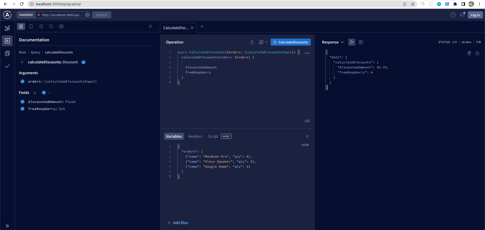

# Shopping Cart

## API

api service is built using [keystone](https://keystonejs.com)

```
cd api
```

If it is first time running, seed date before running

```
yarn dev:reset
```

Run on local machine

```
yarn dev
```

Run unit test

```
yarn test
```

After spinning up api, it offers

- GraphQL playground [http://localhost:3000/api/graphql](http://localhost:3000/api/graphql)
- Admin UI [http://localhost:3000](http://localhost:3000)

For example :


## CLIENT

api service is built using [nextjs](https://nextjs.org/)

```
cd client
```

Run on local machine

```
yarn dev
```

It will be running on [http://localhost:8000](http://localhost:8000)

This client app is just show case my front end skill including apollo for GraphQL, hence, due to time constrains, only loads the inverntory item on home page.
